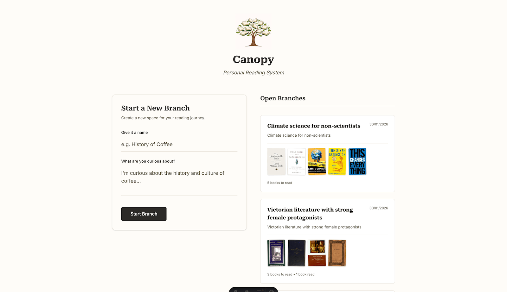
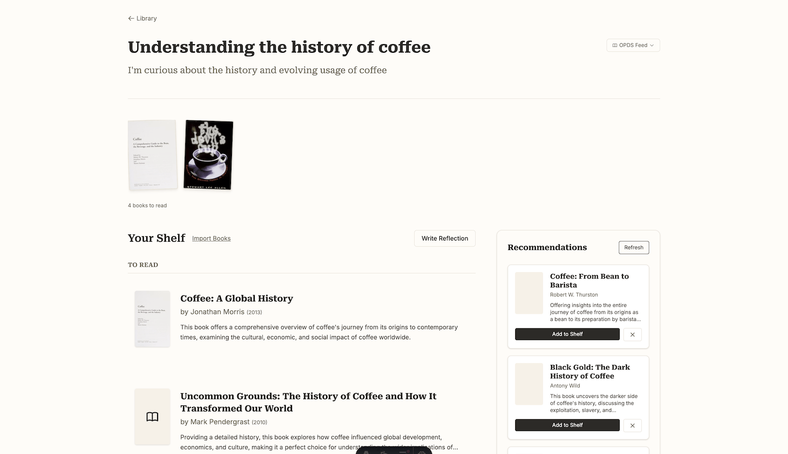
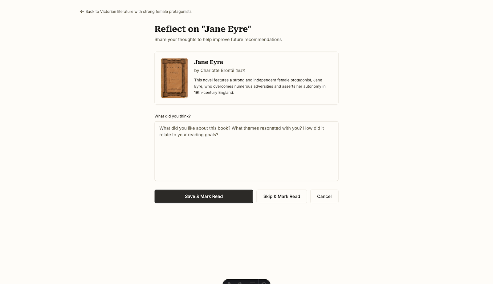

# Canopy: Your Personal Reading Companion

> A local-first, low-maintenance AI reading system that prioritizes reflection and long-term value over engagement metrics.

Canopy helps you organize your reading life around **branches**—themes, questions, or curiosities that guide what you read. Unlike traditional reading apps that provide generic recommendations based on your entire reading history, Canopy delivers **category-specific recommendations** that learn your precise preferences within each area of interest.

<details>
<summary>Screenshots</summary>






</details>

## Why Canopy?

**For Readers Who:**

- Want to organize reading around **themes and categories**, not just "want to read" lists
- Value **reflection** over consumption metrics
- Prefer **local-first** software where their data stays with them
- Want **inspectable history**—every decision is recorded and reversible
- Need **OPDS integration** to sync with e-reader apps (Kobo, Apple Books, etc.)
- Appreciate **AI assistance** that learns from their reading journey

**What Makes Canopy Different:**

- **Event Sourcing**: Your entire reading recommendations history is an append-only log. Nothing is ever lost, and you can inspect exactly how your reading evolved.
- **Branch-Based Organization**: Organize reading by category ("Victorian Literature", "Climate Science", "Philosophy of Mind") rather than arbitrary lists or overall recommendations.
- **Context-Aware AI**: Recommendations improve as you add books and reflections. The AI learns what you've accepted, rejected, and why per category. AI doesn't cross categories, allowing for fine-grained preferences and better recommendations in specific areas of interest.
- **OPDS Export**: Export your reading lists as OPDS feeds for integration with e-reader apps.
- **Metadata Enrichment**: Automatic cover images, ISBNs, and publication details via OpenLibrary integration.
- **Reflection System**: Write reflections on books or entire branches. These inform future recommendations and allow for fine-tuning of category recommendations.
- **Local-First**: All data stored as files. No database, no cloud lock-in. Your reading data is yours.

## How Canopy Compares to Goodreads & Similar Platforms

Canopy is **not a replacement** for Goodreads, LibraryThing, or other large-scale reading platforms. Instead, it's designed to **work alongside them** as a specialized recommendation engine for readers with specific, category-focused preferences.

### The Problem with General Recommendation Systems

Platforms like Goodreads excel at social features, book discovery, and tracking your overall reading history. However, their recommendation algorithms consider your **entire reading history** across all genres and categories. This creates a problem for readers who:

- Have **wide-ranging reading interests** across many genres
- Have **specific preferences within each genre** that differ from their overall tastes
- Want to **explore new categories** without their existing preferences contaminating recommendations

**Example**: If you love literary fiction with complex characters, but also enjoy light sci-fi adventures, Goodreads might recommend dense character-driven sci-fi when you're looking for space operas. Your preferences in one category bleed into another.

### How Canopy Solves This

Canopy uses **category-specific branches** that operate independently:

- Each branch (category) maintains its own recommendation context
- Your preferences in "Victorian Literature" don't influence recommendations in "Climate Science"
- You can sample different genres without polluting your recommendations
- Each branch learns from your specific feedback and reflections within that category

**Perfect for readers who:**

- Read across multiple genres but want genre-specific recommendations
- Have nuanced preferences that vary by category
- Want to explore new areas without their existing reading history affecting results
- Prefer specialized, curated recommendations over broad algorithmic suggestions

### Using Canopy with Other Platforms

Canopy complements existing reading platforms:

- **Goodreads**: Use for social features, reviews, and tracking your overall reading
- **Canopy**: Use for category-specific recommendations and curated reading lists
- **OPDS Export**: Export Canopy branches to sync with e-reader apps

Think of Canopy as your **personal librarian** who understands your specific interests within each category, while Goodreads remains your **social reading network**.

## Quick Start

### Prerequisites

- Node.js 18+ (the latest LTS is recommended)
- npm or yarn

### Installation

```bash
# Clone the repository
git clone https://github.com/joshmcarthur/canopy-reading.git
cd canopy-reading

# Install dependencies
npm install

# Set up environment variables (optional)
# Create a .env file and add your OPENAI_API_KEY if you want AI recommendations
# OPENAI_API_KEY=sk-your-key-here
```

### Running Locally

```bash
# Start the development server
npm run dev

# Open http://localhost:4321
```

### Configuration

Canopy uses environment variables for configuration:

| Variable                 | Description                                      | Default                            |
| ------------------------ | ------------------------------------------------ | ---------------------------------- |
| `OPENAI_API_KEY`         | OpenAI API key for AI recommendations (optional) | Falls back to mock recommendations |
| `CANOPY_DATA_DIR`        | Directory where branches and events are stored   | `./data`                           |
| `CANOPY_STORAGE_ADAPTER` | Storage adapter type                             | `filesystem`                       |

**Note**: Without `OPENAI_API_KEY`, Canopy will use mock recommendations. This is fine for testing, but you'll want a real API key for production use.

## How It Works

### 1. Create a Branch

A **branch** is a reading category — a theme or question that guides your reading. Examples:

- "Understanding the history of coffee"
- "Victorian literature with strong female protagonists"
- "Climate science for non-scientists"

Each branch starts with a name and a seed prompt describing your intent.

Recommendations appear automatically in your **Inbox** for review.

### 3. Curate Your Shelf

From the Inbox, you can:

- **Add to Shelf**: Move books to your library (ACCEPTED or DEFERRED status)
- **Reject**: Dismiss books that don't fit
- **Mark as Read**: Track books you've already finished

### 4. Reflect

Write reflections on individual books or entire branches. These reflections:

- Become part of your reading history
- Inform future AI recommendations
- Help you understand your own reading patterns

### 5. Export to OPDS

Export any branch as an OPDS feed to sync with e-reader apps:

```
/api/branches/[slug]/opds
```

Compatible with:

- Kobo e-readers
- Apple Books
- Calibre
- Any OPDS-compatible reader

### 6. Import from OPDS

Import books from OPDS catalogs (like library catalogs or other reading lists) directly into a branch.

## Data Storage

Canopy uses **file-based event sourcing**. All data is stored as human-readable JSON files:

```
data/
└── branches/
    └── your-branch-slug/
        ├── meta.json              # Branch metadata
        └── events/
            ├── 001-branch-created.json
            ├── 002-recommendations-generated.json
            ├── 003-item-status-changed.json
            └── ...
```

**Benefits:**

- ✅ Git-friendly (version control your reading history)
- ✅ Human-readable (open files in any text editor)
- ✅ Portable (copy the `data/` directory to backup)
- ✅ Inspectable (see exactly how your reading evolved)

## Deployment

### Local Development

```bash
npm run dev
```

### Production Build

```bash
npm run build
npm run preview
```

### Self-Hosting

Canopy is built with Astro SSR and can be deployed to any Node.js hosting platform:

**Vercel / Netlify:**

```bash
npm run build
# Deploy the dist/ directory
```

**Docker:**

```dockerfile
FROM node:24-alpine AS builder
WORKDIR /app
COPY package*.json ./
RUN npm ci
COPY . .
RUN npm run build

FROM node:24-alpine
WORKDIR /app
COPY package*.json ./
RUN npm ci --only=production
COPY --from=builder /app/dist ./dist
EXPOSE 4321
ENV PORT=4321
CMD ["node", "dist/server/entry.mjs"]
```

**Note**: For persistent data storage, mount a volume to your `CANOPY_DATA_DIR`:

```bash
docker run -v /path/to/data:/app/data -e CANOPY_DATA_DIR=/app/data ...
```

**Traditional Server:**

1. Build: `npm run build`
2. Run: `node dist/server/entry.mjs` (listens on port 4321 by default)
3. Configure reverse proxy (nginx, Caddy, etc.) to forward requests

**Cloudflare Workers:**
Canopy also supports Cloudflare Workers with Durable Objects. See `astro.config.mjs` and `wrangler.toml` for configuration details.

### Environment Variables in Production

Set environment variables in your hosting platform:

```bash
OPENAI_API_KEY=sk-...
CANOPY_DATA_DIR=/path/to/data  # For persistent storage
```

**Important**: Ensure your `CANOPY_DATA_DIR` is persistent across deployments. On platforms like Vercel, you may need to use external storage (S3, etc.) or a different storage adapter.

## Architecture

- **Framework**: [Astro](https://astro.build) with SSR
- **Storage**: File-based event sourcing (extensible to other adapters)
- **AI**: OpenAI GPT-4 (with mock fallback)
- **Metadata**: OpenLibrary API integration
- **Styling**: Tailwind CSS
- **Testing**: Vitest

## Development

```bash
# Run tests
npm test

# Lint and format
npm run check
npm run check:fix

# Type checking
npm run astro check
```

## Philosophy

Canopy is **personal software**—designed for individual use, not social engagement. It prioritizes:

1. **Reflection over consumption**: The goal isn't to read more books, but to find books that are hyper-relevant to your interests.
2. **Local-first**: Your data belongs to you. No cloud lock-in, no vendor dependency.
3. **Inspectability**: Every decision is recorded. You can see exactly how your reading evolved.
4. **Low maintenance**: File-based storage means no database migrations, no complex infrastructure. Canopy is designed to be picked up and put down easily without requiring a lot of maintenance.
5. **Long-term value**: Your reading history becomes more valuable over time, not less. Your preferences and reading patterns become more refined and accurate by fine-tuning with your reflections and history.

## Contributing

Contributions welcome! Please open an issue or submit a pull request.

## License

MIT

---

**Built for readers who want precise, category-specific recommendations.**
